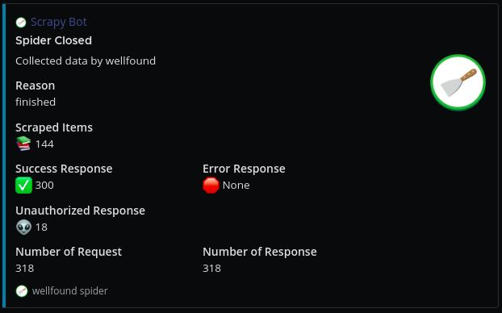

# scrapy-mattermostbot


A [Scrapy](https://scrapy.org/) extension for sending notification to Mattermost channels.

## Installation

```shell
$ pip install scrapy-mattermostbot
```

## Settings

In `settings.py`:

```python
EXTENSIONS = {
    'scrapyslackbot.extensions.Mattermost': 500,
}

MATTERMOST_WEBHOOK_URL = <mattermost webhook url>
```

### MATTERMOST_WEBHOOK_URL

`Mattermost Webhook URL` generated by **mattermost**.

Follow the instructions of [Mattermost Developer Guides](https://developers.mattermost.com/integrate/webhooks/incoming/),


## Development

We use [Pipenv](https://pdm.fming.dev/) as the package and dependency manager. Please make sure you have installed pipenv at first.

```shell
$ pipenv shell
```

## Demo



## License

The project is licensed under the MIT License.
